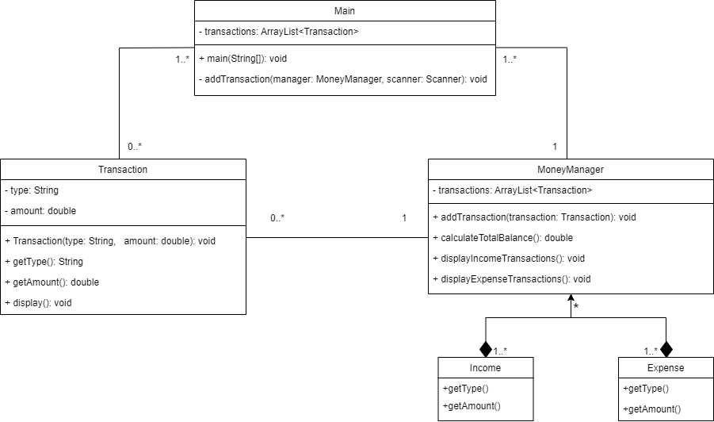

# OODPedit

# OODP_project_Monney_manager

Groupmembers  
Thanaruk Kammarat 6631503021  
Pirisa Kitichai 6631503031  
Maneenat Wantanasri 6631503035  
Woranut Khwanpongdee 6631503036  
Wilasinee Mangkorn 6631503039  

Background and rational
Background : The MoneyManager class is designed as a simple financial management tool to help users keep 
track of their monetary transactions. It is structured as a command-line application that offers basic functionalities
like adding transactions, displaying the total balance, and categorizing transactions into income and expenses. 
This approach fits well for individuals seeking a straightforward, no-frills method to monitor and manage their 
finances.
Rational : Simplicity and Accessibility The decision to implement the application in a console-based interface 
ensures that it is simple enough for users unfamiliar with more complex financial software. This simplicity also 
makes it highly accessible and easy to modify or extend.

List of functions  
The system provides functionality for money management
1. Display money management menu
2. Select want to do from the menu
3. Can add transaction for update the money
4. Add a transaction ( income and expenses ) 
5. Display the total balance
6. Can display income and expenses 
7. Exit the application. 

Class Diagram  
